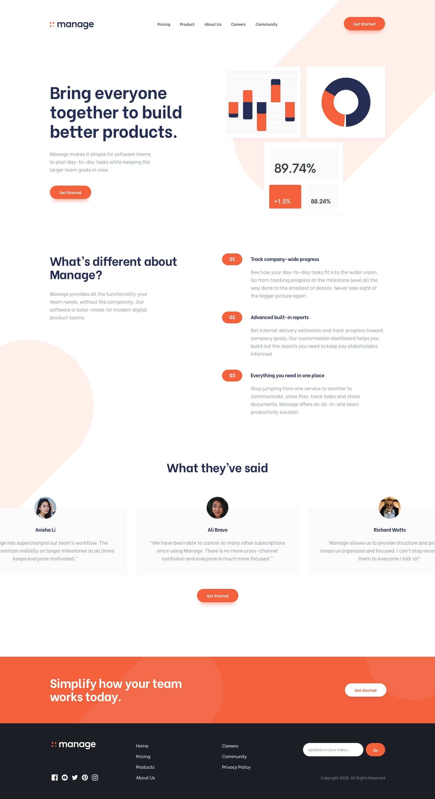

# 📁 Manage Landing Page

This project is a modern website design example. It was developed using HTML and CSS and is fully responsive.  
Created by ARDcoding.  
For feedback, suggestions or questions:  
Contact: ahmetdoraa@gmail.com

---

## 📌 **Table of Contents**
- [Overview](#overview)
- [Technologies Used](#technologies-used)
- [Screenshots](#screenshots)
- [License](#license)
- [Author](#author)
- [Installation](#installation)

---

## 🔍 **Overview**

This project is a promotional landing page example.  
**Goal:** To build a clean, modern user interface with responsive navigation, grid & flexbox layout, modern typography, and a simple, stylish design.

---

## ⚙️ **Technologies Used**

- HTML5
- CSS3
- Responsive Design
- JavaScript
- Google Fonts

---

## 📷 **Screenshots**

  
  
  
  


---

## 📄 **License**
This project is licensed for personal portfolio and educational use only. 
You may modify, share, and adapt it for non-commercial purposes.

---

## 👤 **Author**
Ahmet Rüchan Dora (ARDcoding)

📧 Email: ahmetdoraa@gmail.com

🔗 GitHub: ardcoding

---

## 🚀 **Installation**

Clone this project to your computer:
```bash
git clone https://github.com/ardcoding/landingpage-website.git
